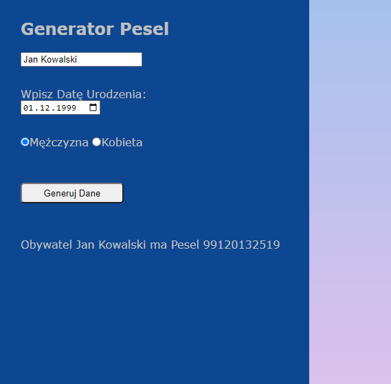

# Pesel Number Generator/ Pesel Generator
> A small web app for generating Pesel Number.
> You can check live demo [_here_](https://noszczykmichal.github.io/pesel-generator/index.html). 

## Table of Contents
* [General Info](#general-information)
* [How the Pesel Number is calculated?](#how-the-pesel-number-is-calculated?)
* [Technologies Used](#technologies-used)
* [Screenshots](#screenshots)
* [Setup](#setup)
* [Project Status](#project-status)
* [Contact](#contact)


## General Information
- Pesel number is 11 digits number given to citizens in Poland that allows for easy identification of a person who owns it (more info [here](https://www.gov.pl/web/gov/czym-jest-numer-pesel)).
- This app generates Pesel number in compliance with all the regulations accessible online on Government site.
- This project was my very first on the way to learning programming. Recently I refactored code and improved calculations of the Pesel also for the people who will be born in the 22nd and 23rd century.

## How the Pesel Number is calculated?
- All the resources I've been working with can be found here - available in [Polish](https://www.gov.pl/web/gov/czym-jest-numer-pesel) or alternatively in English on the website of [UOW](https://welcome.uw.edu.pl/during-your-stay/pesel-number/).
- Pesel number has fixed structure:
```
YYMMDDPPPPK
```
- YY - last two digits of a year person was born in
- MM - month
- DD - day
- PPPP - random number, but the last digit indicates person’s gender - odd number is for male, even – for female ( zero here is treated as even)
- K - control number

The adopted methodology for coding the month of birth allows for differentiation of persons born in 5 distinct centuries. The consecutive months in each century have the following numbers:

|Month      |1800-1899 |1900-1999 |2000-2099 |2100-2199 |2200-2299 |
|-----------|:--------:|:--------:|:--------:|:--------:|:--------:|
|January    |81        |01        |21        |41        |61        |
|February   |82        |02        |22        |42        |62        |
|March      |83        |03        |23        |43        |63        |
|April      |84        |04        |24        |44        |64        |
|May        |85        |05        |25        |45        |65        |
|June       |86        |06        |26        |46        |66        |
|July       |87        |07        |27        |47        |67        |
|August     |88        |08        |28        |48        |68        |
|September  |89        |09        |29        |49        |69        |
|October    |90        |10        |30        |50        |70        |
|November   |91        |11        |31        |51        |71        |
|December   |92        |12        |32        |52        |72        |

The last 11th digit can be calculated in 3 easy steps:
1. All 10 digits have to be multiplied by consecutive weighs assigned to them: 1-3-7-9-1-3-7-9-1-3. Taking as example number 0207080362:

0 * 1 = 0  
2 * 3 = 6  
0 * 7 = 0  
7 * 9 = 63  
0 * 1 = 0  
8 * 3 = 24  
0 * 7 = 0  
3 * 9 = 27  
6 * 1 = 6  
2 * 3 = 6  

2. If result of multiplication is two digit number take as its result the last digit of the number. The individual results should be added e.g.
0+6+0+3+0+4+0+7+6+6=32
3. The result obtained by adding all the numbers should be then modulo'ed by 10. The number which we will get should be then subtracted from 10- the number obtained as a result is the control number. If the result of modulo by 10 is 0, then control number equals 0.
32%10=2
10-2=8

## Technologies Used
- HTML
- CSS
- VanillaJS


## Screenshots



## Setup
To play around with this project, simply:
```
# Clone this repository
$ git clone https://github.com/noszczykmichal/pesel-generator
# Go to the source directory and open index.html file 
  in a browser of your choice
```
or check a live demo [_here_](https://noszczykmichal.github.io/pesel-generator/index.html).


## Project Status
Project is completed and probably won't be developed in the future. Recently some improvements have been done over the prior version as noted in [General Info](#general-information).


## Contact
Created by [@noszczykmichal](https://noszczykmichal.github.io/portfolio/index.html#contact) - feel free to contact me!
